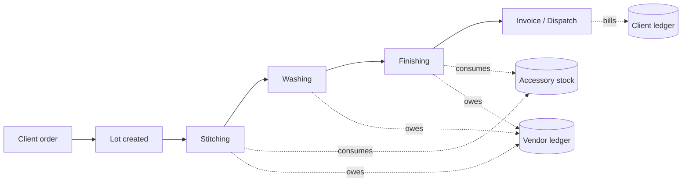

# GreySage ERP

An ERP for garment manufacturing. Bulk client orders are split into lots, tracked through a three-stage vendor production pipeline, and billed out as invoices — with per-vendor and per-client ledgers, consumable stock control, and reporting on top.

**Stack:** Node.js · Express · MongoDB · React · Docker

---

## Contents

- [What it does](#what-it-does)
- [Architecture](#architecture)
- [Tech stack](#tech-stack)
- [Getting started](#getting-started)
- [Environment variables](#environment-variables)
- [Project structure](#project-structure)
- [API overview](#api-overview)
- [Scripts and migrations](#scripts-and-migrations)
- [Scheduled jobs](#scheduled-jobs)
- [Deployment](#deployment)

---

## What it does

### Production

A **Lot** is the root record — a batch of garments for one client, created at the start of the stitching flow. Each lot carries a lot number in the format `SERIES/SUBSERIES[/LOTNUM]` (for example `A/1/5`, meaning series `A`, batches 1 through 5; a single batch is written `A/46`). A series caps at 100 batches before rolling over to the next letter. Lot numbers are parsed and validated for range overlap on entry, so two lots can never claim the same batch.

Each lot moves through three stages, each performed by an external vendor at a per-piece rate:

| Stage | Records | Notes |
|---|---|---|
| **Stitching** | quantity, rate, thread colours | Thread colour quantities must sum to the lot quantity |
| **Washing** | one or more wash detail rows | Each row has its own colour, creation, quantity and rate |
| **Finishing** | quantity, rate | Final stage before dispatch |

Shortages cascade forward. Recording a shortfall at stitching automatically reduces the quantity available at washing, which in turn re-derives the finishing quantity, so the three stages can never drift out of agreement. Out-dates auto-fill: creating a washing entry stamps the stitching record's out-date, and creating a finishing entry stamps the washing record's.

### Vendor payments

A ledger per vendor, per vendor type. Payments can be recorded against a vendor as a lump sum or against a specific lot, alongside short-quantity adjustments. Every entry is versioned to a history collection with before/after snapshots. A denormalised balance per vendor tracks total due, total paid, and remaining, with Excel export for both the lots view and the payments view.

### Sales, dispatch and billing

One invoice equals one dispatch event and one printable document — a Bill of Supply or Tax Invoice, generated client-side as a PDF. Each invoice carries any number of line items, each drawing pieces from a lot; a lot can be dispatched in parts across several invoices, and the remaining pieces are derived from the production total minus what has already been invoiced. Cancelling an invoice returns its pieces to the available pool.

Invoice numbers are scoped to the Indian financial year (starting 1 April) and allocated atomically, in the form `INV2627/29`. Client details, billing address and shipping address are snapshotted onto the invoice at issue time and never refreshed, so a printed document and its stored record always match.

The issuer block printed on every invoice — company name, address, GSTIN, PAN, MSME, bank details, authorised signatory — is configured once under Admin → Company Settings.

### Client payments

The client-side mirror of vendor payments. Payments and adjustments are recorded against a client or against a specific invoice, with payment mode and reference number, full change history, and an opening balance to carry forward pre-go-live outstandings.

### Stock management

Tracks consumable accessories — zippers, buttons, rivets, label-tags, pocketing, polybags — across two independent views:

- **Stock**, per item: opening stock, plus purchases, minus consumption.
- **Money**, per accessory type: opening balance, plus purchases, minus payments and adjustments.

Consumption is hooked into production. Zippers are consumed at the stitching stage; buttons, labels, tags and polybags at finishing, with rivets derived automatically at four per button. Items can be general or mapped to a specific client, and a single lot can draw partly from each. Stock views filter by client. A daily digest emails a low-stock alert.

A separate board tracks extra items held at finishing vendors, including returns.

### Reconciliation

The shared MAKINGS workbook (hosted on OneDrive, one sheet per maker) is parsed nightly and diffed against the database. Discrepancies surface in an in-app notification bell, where each one links through to a pre-filled form to correct it.

### Admin

Dashboards covering order status, production stages by date range, completed quantity by client, top fit styles and vendor performance; catalog management for clients, fit styles and the four vendor types, with drag-and-drop ordering; user management; and an audit log of every write.

---

## Architecture



The backend is a single Express app deployed as a serverless function. Mongoose models all live in one file, `backend/mongodb_schema.js`. Controllers hold business logic; services hold the cross-cutting pieces — balance recalculation, invoice derivation, accessory stock, caching, email, reconciliation.

Several aggregates are **denormalised** for read performance: vendor balances, client balances, accessory balances, and a lot's invoiced-pieces count. These are caches, not sources of truth. Any write that affects them must call the matching recalculation in `services/` afterwards, or the aggregate drifts from its ledger.

Read-heavy endpoints sit behind a Redis read-through cache with version-stamped keys, so invalidating a whole resource family is a single counter increment rather than a key scan.

Because the app runs serverless against a small Atlas tier, the Mongo connection is deliberately tuned — a small pool, no automatic index building, and a cached connection reused across warm invocations.

---

## Tech stack

**Backend**

- Node.js 18, Express 4, Mongoose 7
- JWT access tokens with rotating refresh tokens
- Upstash Redis (REST) for caching
- Brevo SMTP via Nodemailer
- `xlsx` for server-side Excel export and workbook parsing
- `express-validator`, `express-async-errors`

**Frontend**

- React 18, React Router 6, Create React App
- MUI v7 and MUI X v8 — data grid, charts, date pickers
- `react-hook-form`, `dayjs`, `@tanstack/react-table`, `motion`
- `jspdf` + `jspdf-autotable` for invoice PDFs
- No global state library — component-local state, with shared context passed through the router outlet

**Database**

- MongoDB 7.0, replica set required (the stitching flow uses a multi-document transaction)

> **Note:** MUI X is a commercial licence. Set `REACT_APP_MUI_LICENSE_KEY` or the grids and charts will render a watermark.

---

## Getting started

### Prerequisites

- Docker and Docker Compose, **or** Node.js 18+ and a MongoDB 7 replica set
- A MongoDB connection string
- An Upstash Redis database (optional — the cache degrades gracefully without it)

### With Docker

The compose file brings up MongoDB with a replica set initialised automatically, the API, and the frontend.

```bash
git clone https://github.com/orion1911/ERP-GreySage.git
cd ERP-GreySage

# create backend/.env and frontend/.env — see Environment variables below
docker compose up --build
```

| Service | URL |
|---|---|
| Frontend | http://localhost:8080 |
| API | http://localhost:5000 |
| MongoDB | mongodb://localhost:27017 |

### Without Docker

A plain `mongod` will not work — the stitching flow opens a transaction, which requires a replica set. Either run the Mongo service from the compose file on its own, or start `mongod --replSet rs0` and initialise it once with `rs.initiate()`.

```bash
# API
cd backend
npm install
npm start                      # http://localhost:5000

# Frontend, in a second terminal
cd frontend
npm install
npm start                      # http://localhost:3000
```

### First run

Register an account at `/register`, then sign in. Before issuing any invoice, fill in the issuer block at **Admin → Company Settings** — company name, address, GSTIN, PAN, MSME, bank details and authorised signatory all print on every document.

Accessory types seed themselves on first load of the Stock page.

---

## Environment variables

Never commit these files. Set the values in your deployment platform for production.

### `backend/.env`

**Required**

| Variable | Description |
|---|---|
| `MONGO_URI` | MongoDB connection string, including the replica set parameter |
| `JWT_SECRET` | Signing secret for access tokens |
| `CORS_ORIGINS` | Comma-separated list of allowed origins |

**Authentication**

| Variable | Default | Description |
|---|---|---|
| `ACCESS_TOKEN_TTL` | `15m` | Access token lifetime |
| `REFRESH_TOKEN_TTL_HOURS` | `12` | Session length; acts as an idle timeout |
| `REFRESH_TOKEN_TTL_DAYS` | — | Takes precedence over the hours variant if set |

**Cache**

| Variable | Default | Description |
|---|---|---|
| `UPSTASH_REDIS_REST_URL` | — | Upstash REST endpoint |
| `UPSTASH_REDIS_REST_TOKEN` | — | Upstash REST token |
| `CACHE_ENABLED` | production only | Force caching on or off |
| `CACHE_TTL_MASTERS` | `3600` | Catalog cache lifetime, seconds |
| `CACHE_TTL_LEDGER` | `600` | Ledger cache lifetime, seconds |
| `CACHE_TTL_DASHBOARD` | `600` | Dashboard cache lifetime, seconds |

**Email**

| Variable | Default | Description |
|---|---|---|
| `BREVO_SMTP_USER` | — | Brevo SMTP login |
| `BREVO_SMTP_KEY` | — | Brevo SMTP key |
| `BREVO_SMTP_HOST` | `smtp-relay.brevo.com` | SMTP host |
| `BREVO_SMTP_PORT` | `587` | 587 for STARTTLS, 465 for implicit TLS |
| `FROM_EMAIL` | — | Verified sender address |

**Reconciliation and jobs**

| Variable | Description |
|---|---|
| `ONEDRIVE_FILE_URL` | Share link to the MAKINGS workbook, with `?download=1` |
| `MAKINGS_MAKER_SHEETS` | Comma-separated sheet names to scan; defaults to the built-in list |
| `MAKINGS_DATE_CUTOFF` | Ignore workbook rows before this date |
| `CRON_SECRET` | Bearer token required by the scheduled endpoints |

### `frontend/.env`

| Variable | Description |
|---|---|
| `REACT_APP_API_URL` | Base URL of the API |
| `REACT_APP_MUI_LICENSE_KEY` | MUI X commercial licence key |
| `REACT_APP_DATA_LOAD_TIMEOUT` | Request timeout in milliseconds |

---

## Project structure

```
ERP-GreySage/
├── backend/
│   ├── server.js               # Entry point: CORS, DB connection, route mounting
│   ├── mongodb_schema.js       # All Mongoose models
│   ├── routes/                 # One file per resource
│   ├── controllers/            # One file per resource
│   ├── services/
│   │   ├── vendorBalanceService.js
│   │   ├── clientBalanceService.js
│   │   ├── invoiceService.js
│   │   ├── accessoryService.js
│   │   ├── makingsReconService.js
│   │   ├── notificationService.js
│   │   ├── emailService.js
│   │   └── cache.js
│   ├── middleware/             # auth, error handling
│   ├── migrations/             # One-time data migrations and seeds
│   ├── scripts/                # Operational utilities
│   └── utils/logger.js         # Audit log writer
│
├── frontend/
│   └── src/
│       ├── App.js              # All routes and layouts
│       ├── components/         # Navbar, theme, shared UI
│       ├── features/           # Domain-grouped feature folders
│       │   ├── Orders/  Stitching/  Washing/  Finishing/
│       │   ├── VendorPayments/  ClientPayments/
│       │   ├── Sales/  Stock/  Catalogs/  Admin/  Login/
│       └── services/           # axios instance, API layer, auth
│
├── ext/process.py              # Standalone workbook parsing utility
├── docker-compose.yml
└── init-mongo.js
```

Two conventions worth knowing when adding code:

- **Catalogs** follow a triplet — `{Name}Catalog.js` for the list, `{Name}CatalogAdd.js` for the create/edit modal, `{Name}CatalogSx.js` for styles. Copy the triplet when adding a lookup.
- **API calls** all go through `frontend/src/services/apiService.js`, grouped by domain. Components do not call axios directly.

---

## API overview

Most resources are mounted flat under `/api`. Five are sub-prefixed:

| Prefix | Covers |
|---|---|
| `/api/vendor-balances` | Vendor payment entries, balances, lot details, Excel export |
| `/api/sales-invoices` | Invoice CRUD, available lots, cancel, history |
| `/api/client-balances` | Client payments, ledger, opening balance, history |
| `/api/company-settings` | Issuer singleton |
| `/api/accessories` | Types, items, purchases, payments, stock, consumption |
| `/api/cron` | Scheduled jobs, secret-guarded |

Everything else — auth, users, clients, fit styles, vendors, lots, stitching, washing, finishing, dashboard, reports, audit logs, makings — sits directly under `/api`.

All endpoints require a bearer token except `/api/auth/*`, the contact form, and the public finishing-extras board. Purchases and payments are server-paginated, returning `{ rows, total }`.

---

## Scripts and migrations

Run from the repository root. Each takes a connection string as its first argument, falling back to `MONGO_URI`.

**Migrations** (`backend/migrations/`)

| Script | Purpose |
|---|---|
| `migrate-orders-to-lots.js` | One-time historical migration from the retired Order model |
| `seed-accessory-data.js` | Seeds accessory masters, opening stock, purchases and payments. Idempotent; pass `--wipe` for a full reset |
| `dedupe-accessory-types.js` | Removes duplicate accessory type rows |

**Utilities** (`backend/scripts/`)

| Script | Purpose |
|---|---|
| `clone_prod_to_dev.js` | Copies the production database into the development one |
| `verifyLowStock.js` | Dry-runs the low-stock calculation |
| `rollbackInvoices.js` | Reverses a batch of invoices |
| `report_suspicious_finishing_lots.js` | Flags finishing records with inconsistent quantities |

> The Atlas cluster hosts more than one database. Confirm which one a script targets before running it.

---

## Scheduled jobs

Two cron endpoints run daily. Both are guarded by `CRON_SECRET` rather than a user token, and expect it as a bearer header.

| Schedule (UTC) | Endpoint | Job |
|---|---|---|
| 02:00 | `/api/cron/makings-recon` | Parse the MAKINGS workbook and store the diff |
| 03:30 | `/api/cron/low-stock-digest` | Email the low-stock digest to configured recipients |

---

## Deployment

The API and frontend deploy as separate projects.

**API** — deployed as a serverless function. `server.js` exports the Express app rather than calling `listen`, which only runs outside production. Schedules are declared in `backend/vercel.json`. Set every backend environment variable in the platform's settings.

**Frontend** — a static Create React App build. Set the three `REACT_APP_*` variables in the platform's settings; they are inlined at build time, so a change requires a rebuild.

**Database** — MongoDB Atlas, replica set enabled by default. Note that the API connects with automatic index building disabled to keep cold starts fast, so index changes must be applied deliberately rather than being picked up on deploy.

---

## Author

Adil Khan

Licensed under ISC.